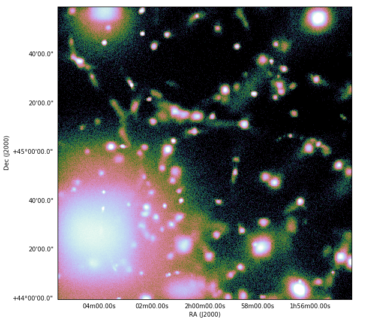

.. _light-cone:

Generating Light Cone Simulations of X-rays
===========================================

Light cones are created by stacking multiple datasets together to continuously 
span a given redshift interval. To make a projection of a field through a light 
cone, the width of individual slices is adjusted such that each slice has the 
same angular size. Each slice is randomly shifted and projected along a random 
axis to ensure that the same structures are not sampled multiple times. For more 
information about how light cones are created and used in yt, 
see `this documentation <https://yt-astro-analysis.readthedocs.io/en/latest/light_cone_generator.html>`_.

.. note::

    This functionality requires installing the 
    `yt_astro_analysis package <https://yt-astro-analysis.readthedocs.io/>`_,
    and it should be installed from source. To do this, checkout the 
    `installation documentation <https://yt-astro-analysis.readthedocs.io/en/latest/Installation.html#installing-from-source>`_.

The :class:`~pyxsim.source_generators.light_cone.XrayLightCone` object allows 
one to make a projected set of X-ray events from a light cone solution, 
combining yt's light cone machinery with the X-ray photon generation
capabilities of pyXSIM. The dataset used in this example is the 
`Enzo_64 <http://yt-project.org/data/Enzo_64.tar.gz>`_ dataset and can be 
downloaded from http://yt-project.org/data.

.. warning::

    This feature is currently in beta, and only works for Enzo or Gadget-based
    cosmological simulations. In the future, it will be expanded to other types
    of datasets. If you'd like to see support for your type of dataset, 
    `get in contact <faq.html>`_!

First, one needs to create the 
:class:`~pyxsim.source_generators.light_cone.XrayLightCone` object:

.. code-block:: python

    parameter_filename = 'Enzo_64/64.param' # parameters for the simulation
    simulation_type = "Enzo" # For now, this and Gadget are only options that work
    near_redshift = 0.0
    far_redshift = 0.9
    lc = pyxsim.XrayLightCone(parameter_filename, simulation_type, 
                              near_redshift, far_redshift)
    
This takes a time series of datasets from the cosmological simulation and 
creates the light cone solution. There are additional optional keyword 
arguments (which are the same as those taken by
:class:`~yt.analysis_modules.cosmological_observation.light_cone.light_cone.LightCone`).
They are:

* ``seed`` (integer): If an integer is supplied here, a constant set of random
  numbers will be used to construct the light cone. Default: None, which will
  use the current system time to seed the random number generator. 
* ``use_minimum_datasets`` (boolean): If True, the minimum number of datasets 
  is used to connect the initial and final redshift. If False, the light cone 
  solution will contain as many entries as possible within the redshift 
  interval. Default: True.
* ``deltaz_min`` (float): Specifies the minimum :math:`\Delta{z}` between 
  consecutive datasets. Default: 0.0.
* ``minimum_coherent_box_fraction`` (float): Used with ``use_minimum_datasets`` 
  set to False, this parameter specifies the fraction of the total box size to 
  be traversed before rerandomizing the projection axis and center. This was 
  invented to allow light cones with thin slices to sample coherent large 
  scale structure, but in practice does not work so well. Try setting this 
  parameter to 1 and see what happens. Default: 0.0.

After the :class:`~pyxsim.source_generators.light_cone.XrayLightCone` has been 
created, we have to implement a source model to determine how the photons will 
be generated from the source properties (as usual). In this case, we'll simply 
use the :class:`~pyxsim.source_models.ThermalSourceModel`:

.. code-block:: python

    source_model = pyxsim.ThermalSourceModel("apec", 0.1, 10.0, 1000)

Now, we are ready to generate our simulated events using 
:meth:`~pyxsim.source_generators.light_cone.XrayLightCone.generate_events`. 
Since by definition a light cone is a projection, the 
:class:`~pyxsim.source_generators.light_cone.XrayLightCone` creates both
photon and event lists together from a single call. We must specify an exposure
time, collecting area, field of view in units of angle, the source model, and 
the center of the field of view in (RA, Dec). The 
:meth:`~pyxsim.source_generators.light_cone.XrayLightCone.generate_events` 
method also takes a number of the same optional parameters as 
:class:`~pyxsim.photon_list.project_photons`, so we'll also absorb the events 
with the ``wabs`` model and smooth the positions just a bit for visualization 
purposes.

.. code-block:: python

    exp_time = 50000.0 # exposure time in seconds
    area = 25000.0 # collecting area in cm**2
    fov = (2.0, "deg") # field of view
    sky_center = (30.0, 45.0) # sky center in degrees
    photon_prefix = "enzo_64_photons"
    event_prefix = "enzo_64_events"
    lc.generate_events(photon_prefix, event_prefix, area, exp_time,
                       fov, source_model, sky_center, absorb_model="wabs",
                       nH=0.02, sigma_pos=0.5)

If we make an image of this :class:`~pyxsim.event_list.EventList`, it looks
like this:

.. code-block:: python

    events = pyxsim.EventList("enzo_64_events")
    events.write_fits_image("light_cone_img.fits", fov, 1024)

