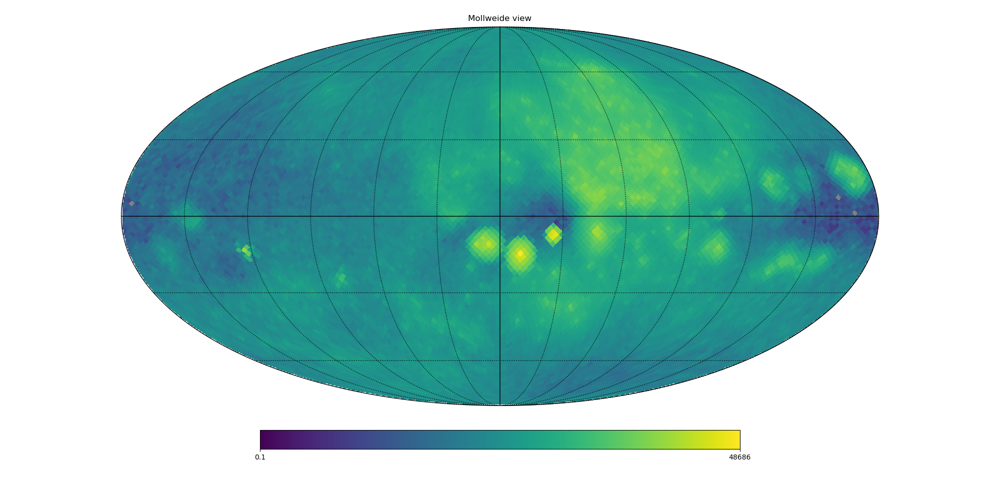

.. _allsky:

"Internal" Observers and "All-Sky" Observations
-----------------------------------------------

The default observing mode for pyXSIM is that of an "external" observer
at a very large distance from a source. In this mode, we assume a flat-sky 
approximation for projecting the photons. It is also possible to make 
observations for nearby sources for which this approximation no longer applies,
and a "spherical projection" is assumed. Such sources could be a large, nearby 
object, or a simulation of the emission from the hot gas of a galaxy from within 
the galaxy itself. In these cases, the flux of photons from each part (cell or 
particle) of the source depends on the distance to that part of the source, as 
opposed to the distance to the source as a whole for the "flat-sky" case. In this 
mode, photons could come from sources at any position on the sky, so it is ideal 
for making all-sky maps. 

Instead of the :func:`~pyxsim.photon_list.project_photons` function, this functionality
uses the :func:`~pyxsim.photon_list.project_photons_allsky` function, which takes the
following parameters:

* ``photon_prefix``: The prefix of the filename(s) containing the photon list.
  If run in serial, the filename will be "{photon_prefix}.h5", if run in 
  parallel, the filenames will be "{photon_prefix}.{mpi_rank}.h5".
* ``event_prefix``: The prefix of the filename(s) which will be written to
  contain the event list. If run in serial, the filename will be 
  ``"{event_prefix}.h5"``, if run in parallel, the filename will be 
  ``"{event_prefix}.{mpi_rank}.h5"``.
* ``normal``: The vector determining the "z" or "up" vector for the spherical 
  coordinate system for the all-sky projection, something like [1.0, 2.0, -3.0]
* ``absorb_model`` (optional): A string representing a model for foreground 
  galactic absorption. The two models included in pyXSIM for absorption are:
  ``"wabs"`` (`Wisconsin (Morrison and McCammon; ApJ 270, 119) <http://adsabs.harvard.edu/abs/1983ApJ...270..119M>`_),
  and ``"tbabs"`` (`Tuebingen-Boulder (Wilms, J., Allen, A., & McCray, R. 2000, ApJ, 542, 914) <http://adsabs.harvard.edu/abs/2000ApJ...542..914W>`_).
  The default is no absorption--if an absorption model is chosen, the ``nH``
  parameter must also be set. 
* ``nH`` (optional): The foreground galactic column density in units of 
  :math:`10^{22} \rm{atoms} \rm{cm}^{-2}`, for use when one is applying 
  foreground galactic absorption.
* ``abund_table`` (optional): The abundance table to be used for abundances in the 
  TBabs absorption model. Default is set in the SOXS configuration file, the default 
  for which is ``"angr"``. Other options are ``"angr"``, ``"aspl"``, ``"lodd"``,
  ``"feld"``, ``"wilm"``, and ``"cl17.03"``. For the definitions of these, see
  :ref:`solar-abund-tables`.
* ``no_shifting`` (optional): If set to True, the photon energies will not be
  velocity Doppler shifted. Default False.
* ``save_los`` (optional): If ``True``, save the line-of-sight positions along 
  the radial direction in units of kpc to the events list. Default: ``False``.
* ``prng`` (optional): An integer seed, pseudo-random number generator, 
  :class:`~numpy.random.RandomState` object, or :mod:`~numpy.random` (the 
  default). Use this if you have a reason to generate the same set of random 
  numbers, such as for a test. 

The following example shows how to create such an observation of the circumgalactic
medium from "inside a galaxy", using a 
`Milky Way-sized halo <https://www.tng-project.org/api/TNG50-1/snapshots/99/subhalos/494709/>`_ 
extracted from `Illustris TNG <https://www.tng-project.org>`_ (the actual dataset used is the 
``parent_halo`` with ID = 136). First, we load up the dataset in ``yt``, and put a filter on 
the gas cells so that we only consider gas that is likely to be X-ray emitting:

.. code-block:: python

    import yt
    import numpy as np
    import pyxsim
    import soxs
    
    # define hot gas filter 
    def hot_gas(pfilter, data):
        pfilter1 = data[pfilter.filtered_type, "temperature"] > 3.0e5
        pfilter2 = data["PartType0", "StarFormationRate"] == 0.0
        pfilter3 = data[pfilter.filtered_type, "density"] < 5e-25
        return pfilter1 & pfilter2 & pfilter3
    yt.add_particle_filter("hot_gas", function=hot_gas,
                           filtered_type='gas', requires=["temperature","density"])
    
    # load dataset and assign filter
    ds = yt.load("cutout_136.hdf5")
    ds.add_particle_filter("hot_gas")

Next, we specify the location of the observer and the "up" vector, which defines
our coordinate system. Essentially, this determines where the "north pole" of our
spherical coordinate system is. 

.. code-block:: python

    # center of galaxy in code length
    c = ds.arr([15170.3, 1034.51, 20953.5], "code_length")
        
    # center of observer, roughly 5.4 kpc from the center of the galaxy
    c_obs = c + ds.arr([3.55783736, 4.08772821, 0.], "code_length")

    # "up" vector, which defines the "z" axis in a spherical coordinate
    # system
    L = np.array([0.71303562, -0.62060505, 0.32623548])

We want to work in the rest frame of the observer, so we compute the bulk
velocity within a small sphere centered on the observer which will be used
to set the frame later:

.. code-block:: python

    # grab a sphere of radius 0.1 kpc around the observer
    s_obs = ds.sphere(c_obs, (100.0, "pc"))
    
    # get the average gas velocity within the sphere s_obs
    # use all of the gas in this case
    vx = s_obs.mean(("PartType0","particle_velocity_x"), weight=("PartType0", "particle_mass"))
    vy = s_obs.mean(("PartType0","particle_velocity_y"), weight=("PartType0", "particle_mass"))
    vz = s_obs.mean(("PartType0","particle_velocity_z"), weight=("PartType0", "particle_mass"))
    bulk_velocity = ds.arr([vx, vy, vz]).to("km/s")

Now we set up the emission model for our source:

.. code-block:: python

    # metal fields to use
    metals = ["He_fraction", "C_fraction", "N_fraction", "O_fraction",
              "Ne_fraction", "Mg_fraction", "Si_fraction", "Fe_fraction"]
    var_elem = {elem.split("_")[0]: ("hot_gas", elem) for elem in metals}
    
    # set up the source model
    
    emin = 0.25 # The minimum energy to generate in keV
    emax = 1.5 # The maximum energy to generate in keV
    nbins = 5000 # The number of energy bins between emin and emax
    kT_max = 2.0 # The max gas temperature to use
    source_model = pyxsim.CIESourceModel(
        "apec", emin, emax, nbins, ("hot_gas","metallicity"),
        temperature_field=("hot_gas","temperature"),
        emission_measure_field=("hot_gas", "emission_measure"),
        kT_max=kT_max, var_elem=var_elem
    )

And set the observing parameters:

.. code-block:: python

    exp_time = (50., "s") # exposure time
    area = (5000.0, "cm**2") # collecting area
    redshift = 0.0 # the cosmological redshift of the source, this source is local

For determining which cells will be used in the calculation, we choose a 
box of 1 Mpc width centered on the center of the galaxy:

.. code-block:: python

    width = ds.quan(1.0, "Mpc")
    le = c - 0.5*width
    re = c + 0.5*width
    box = ds.box(le, re)

Now we can generate the photons. We use the :meth:`~pyxsim.photon_list.make_photons`
function as usual, but in this case we set ``observer="internal"``. Here, the ``center``
is set to the observer's location, and the ``bulk_velocity`` is set to the observer's
velocity that we calculated above:

.. code-block:: python

    # make the photons
    n_photons, n_cells = pyxsim.make_photons("sub_494709_photons_internal", box,
                                             redshift, area, exp_time, source_model, 
                                             center=c_obs, bulk_velocity=bulk_velocity, 
                                             observer="internal")

Next, we use the :meth:`~pyxsim.photon_list.project_photons_allsky` function to project
the photons along all directions in a spherical projection, using ``L`` to define the 
"north pole" of our sky and applying foreground Galactic absorption:

.. code-block:: python

    # project the photons to an all-sky map
    n_events = pyxsim.project_photons_allsky("sub_494709_photons_internal", 
                                             "sub_494709_events_internal", L, 
                                             absorb_model="wabs", nH=0.01)

This creates a file of events that can be used as normal to create a SIMPUT catalog:

.. code-block:: python

    # write out the events to SIMPUT
    el = pyxsim.EventList("sub_494709_events_internal.h5")
    el.write_to_simput("sub_494709_events_internal", overwrite=True)

The resulting SIMPUT catalog has the same format as the case of "external" observers,
so in theory you could take any 
:ref:`instrument simulator that supports SIMPUT catalogs<instruments>` and point at
a particular location in the sky to look at it. However, it is also possible to create
an "all-sky" map with a particular instrument model using SOXS. For this, we can use
the :meth:`~soxs.instrument.simple_event_list` function, which simply convolves the 
photons in the SIMPUT catalog with the instrument's ARF and RMF:

.. code-block:: python

    # convolve the all-sky map
    soxs.simple_event_list("sub_494709_events_internal_simput.fits", 
                           "sub_494709_internal_evt.fits", (50.0, "s"), "lem_2eV", 
                           overwrite=True, use_gal_coords=True)

No PSF scattering or any other instrumental effects are applied in this mode--the
assumption is that these effects are negligible for the angular sizes one is 
investigating. The ``use_gal_coords=True`` option takes the celestial coordinates
in the file and converts them into Galactic coordinates. 

The resulting event list can used to produce an "all-sky" map in X-rays using 
`healpy <https://healpy.readthedocs.io/>`_ like so:

.. code-block:: python

    import healpy as hp
    import numpy as np
    from astropy.io import fits
    import matplotlib.pyplot as plt

    # specify the minimum and maximum energies (in eV) of the band
    # to plot
    emin = 500.0
    emax = 1500.0
    
    # Open the file, read in the photons (making a cut on energy),
    # then convert latitude and longitude to radians
    with fits.open("sub_494709_internal_evt.fits") as f:
        cut = (f["EVENTS"].data["ENERGY"] > emin) & (f["EVENTS"].data["ENERGY"] <= emax)
        lon = np.deg2rad(f["EVENTS"].data["GLON"][cut])
        lat = np.deg2rad(90.0-f["EVENTS"].data["GLAT"][cut])
    
    # Make the histogram image using HealPy
    nside = 32
    
    pixel_indices = hp.ang2pix(nside, lat, lon)
    
    m = np.bincount(pixel_indices, minlength=hp.nside2npix(nside))

    # Make a plot of the all-sky image and save 

    fig = plt.figure(figsize=(20,10))
    hp.mollview(m, min=0.1, norm='log', fig=fig)
    hp.graticule()
    
    fig.savefig("allsky.png")

In this case, the resulting image looks like this:

