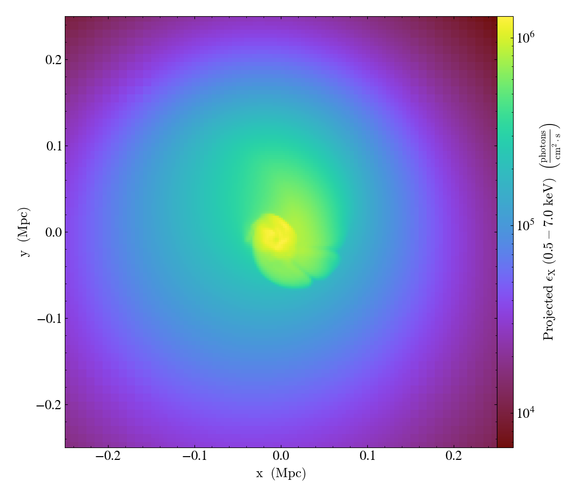
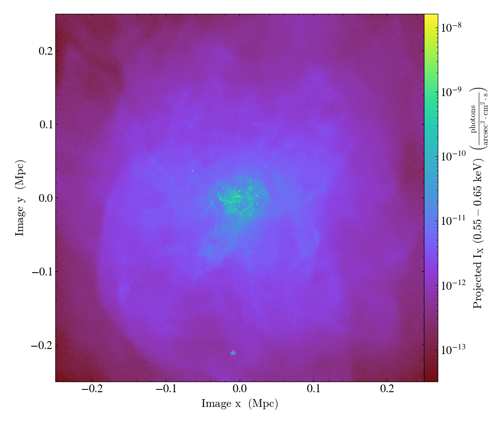

.. _xray-fields:

X-ray Fields for yt
===================

The simplest use of a :class:`~pyxsim.source_models.sources.SourceModel` in pyXSIM is 
to create fields of X-ray emission that can be used in yt to compute emissivities, 
luminosities, or intensities. These can be computed for geometric objects such as 
spheres or boxes or can be projected along a sight line. There are two methods to do
this which are described below.

Source Fields
-------------

One may want to compute fields for the emissivity or the luminosity of a particular
source in its rest frame. This can be done using the 
:meth:`~pyxsim.source_models.sources.SourceModel.make_source_fields` method. This
method takes a :class:`~yt.data_objects.static_output.Dataset` object from yt, 
and the minimum and maximum energies of the band you want to create fields for. 
The example below shows creating source fields for thermal emission from a simulation
of a galaxy cluster: 

.. code-block:: python

    import yt
    import pyxsim
    
    ds = yt.load("GasSloshing/sloshing_nomag2_hdf5_plt_cnt_0100", 
                 default_species_fields="ionized")
    
    emin = 0.1
    emax = 10.0
    nbins = 1000
    Zmet = 0.3 # this dataset does not have a metallicity field, so assume 0.3 Zsolar
    source_model = pyxsim.CIESourceModel("apec", emin, emax, nbins, Zmet)
    
    # arguments are the Dataset, and the emin and emax of the 
    # band 
    xray_fields = source_model.make_source_fields(ds, 0.5, 7.0)

The fields are created for the :class:`~yt.data_objects.static_output.Dataset`
``ds``, and their names are returned in the ``xray_fields`` list:

.. code-block:: python

    print(xray_fields)

.. code-block:: pycon

    [('gas', 'xray_emissivity_0.5_7.0_keV'), 
     ('gas', 'xray_luminosity_0.5_7.0_keV'), 
     ('gas', 'xray_photon_emissivity_0.5_7.0_keV')]
    
Three fields have been created--one for the X-ray emissivity in the chosen band in
:math:`\rm{erg}~\rm{cm}^{-3}~\rm{s}^{-1}`, another for the X-ray luminosity in the
chosen band in :math:`\rm{erg}~\rm{s}^{-1}`, and another for the X-ray photon
emissivity in :math:`\rm{photon}~\rm{cm}^{-3}~\rm{s}^{-1}`. These fields exist in
the same way as any other field in yt, and can be used in the same ways. 

Querying emissivity values in a sphere:

.. code-block:: python

    sp = ds.sphere("c", (500.0, "kpc"))
    print(sp['gas', 'xray_emissivity_0.5_7.0_keV'])

.. code-block:: pycon

    [6.75018212e-30 6.63582106e-30 6.45686636e-30 ... 2.59468150e-30
     2.55886161e-30 2.65063999e-30] erg/(cm**3*s)

Summing luminosity in a sphere:

.. code-block:: python

    print(sp.sum(("gas", "xray_luminosity_0.5_7.0_keV")))

.. code-block:: pycon

    unyt_quantity(7.73753352e+44, 'erg/s')

Projecting the photon emissivity along a sight line:

.. code-block:: python

    prj = yt.ProjectionPlot(ds, "z", xray_fields[-1], width=(0.5, "Mpc"))
    prj.save()

Intensity Fields
----------------

If one wants to compute the fields that are observed locally from the source that
is at a given distance or redshift, this can be done using the 
:meth:`~pyxsim.source_models.sources.SourceModel.make_intensity_fields` method. This
method takes a :class:`~yt.data_objects.static_output.Dataset` object from yt, 
the minimum and maximum energies of the band you want to create fields for, and either
the cosmological redshift of the source (which gives the distance) or the local distance
for a nearby source. These fields are designed specifically for making projections. 

The example below shows creating source fields for thermal emission from a simulation
of the circumgalactic medium of a disk galaxy:

.. code-block:: python

    import yt
    import pyxsim
    
    def hot_gas(pfilter, data):
        pfilter1 = data[pfilter.filtered_type, "temperature"] > 3.0e5
        pfilter2 = data["PartType0", "StarFormationRate"] == 0.0
        pfilter3 = data[pfilter.filtered_type, "density"] < 5.0e-25
        return pfilter1 & pfilter2 & pfilter3

    yt.add_particle_filter(
        "hot_gas",
        function=hot_gas,
        filtered_type="gas",
        requires=["temperature", "density"],
    )
    
    ds = yt.load("cutout_37.hdf5", 
                 bounding_box=[[-1000.0, 1000], [-1000.0, 1000], [-1000.0, 1000]])
    ds.add_particle_filter("hot_gas")

    source_model = pyxsim.IGMSourceModel(
        0.2,
        3.0,
        1000,
        ("hot_gas", "metallicity"),
        binscale="log",
        resonant_scattering=False,
        cxb_factor=0.5,
        kT_max=30.0,
        nh_field=("hot_gas","H_nuclei_density"),
        temperature_field=("hot_gas", "temperature"),
        emission_measure_field=("hot_gas", "emission_measure"),
    )
    
    # arguments are the Dataset, the emin and emax of the band, and the redshift 
    xray_fields = source_model.make_intensity_fields(ds, 0.55, 0.65, redshift=0.01)
    
The fields are created for the :class:`~yt.data_objects.static_output.Dataset`
``ds``, and their names are returned in the ``xray_fields`` list:

.. code-block:: python

    print(xray_fields)

.. code-block:: pycon

    [('hot_gas', 'xray_intensity_0.55_0.65_keV'), 
     ('hot_gas', 'xray_photon_intensity_0.55_0.65_keV')]

These can be used to make projections:

.. code-block:: python

    prj = yt.OffAxisProjectionPlot(ds, [0.0, -1.0, 1.0], xray_fields[-1],
                               width=(0.5,"Mpc"), north_vector=[0.0, 1.0, 1.0])
    prj.save()

.. note::

    At this time, Doppler-shifting of photon energies by motions of the emitting 
    material is not available for the creation of intensity fields in this mode, 
    but it will be available in a future release.
